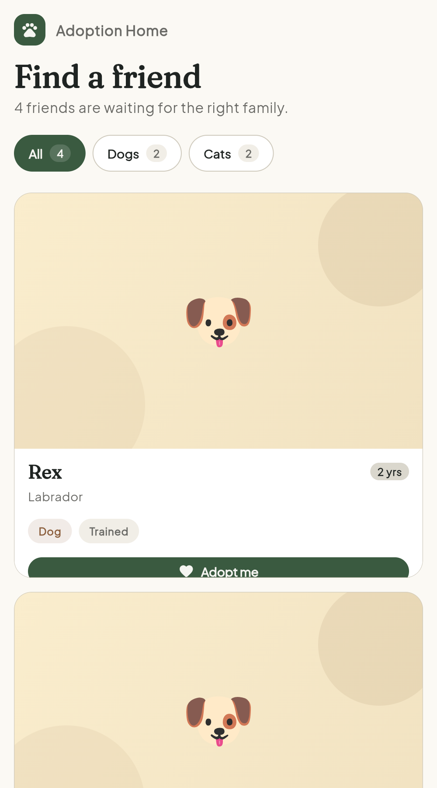

# Adoption Home — Flutter (Showcase)

Production-grade take on the Flutter portion of the GATES IT Solution Full-Stack Developer Assessment. Same rubric as `01-answers/flutter`, but built the way I'd ship it to real users.

**Highlights**

- Feature-first architecture (`domain` / `data` / `application` / `presentation`)
- Riverpod 3 for state, `AsyncNotifier` for the pet list, provider overrides in tests
- Repository as an `abstract interface class` — the UI never touches concrete data
- Custom Material 3 theme (Fraunces display + Plus Jakarta Sans body, seedless palette)
- Adaptive layout — grid that reflows from 1 → 4 columns based on width
- Loading skeleton, empty states per filter, error state, staggered card enter animation
- Adopt action animates via `AnimatedSwitcher` (scale + fade)
- Accessibility — `Semantics` labels on cards and filter chips
- 12 tests across domain, application, and presentation layers

## Architecture

```
lib/
├── main.dart                                  ProviderScope entry
├── app/                                       cross-feature scaffolding
│   ├── app.dart                               MaterialApp + home
│   └── theme/                                 seedless M3 theme
│       ├── app_colors.dart
│       ├── app_spacing.dart
│       └── app_theme.dart
└── features/
    └── pets/
        ├── domain/                            pure Dart, no Flutter imports
        │   ├── pet.dart                       abstract Pet + equality contract
        │   ├── dog.dart                       Dog (isTrained)
        │   ├── cat.dart                       Cat (isIndoor)
        │   └── pet_repository.dart            abstract interface class
        ├── data/
        │   └── in_memory_pet_repository.dart  seed data + simulated latency
        ├── application/                       state + intent
        │   ├── pet_filter.dart                enum
        │   └── pet_providers.dart             Riverpod providers + controllers
        └── presentation/                      widgets only
            ├── pet_list_screen.dart
            └── widgets/
                ├── pet_filter_bar.dart
                ├── pet_card.dart
                ├── pet_grid.dart              staggered enter + adaptive columns
                ├── pet_list_skeleton.dart
                └── empty_state.dart
```

**Layer rules** — respected, not decorative:

| Layer | May import | May not import |
|-------|-----------|----------------|
| `domain` | `flutter/foundation` (for `@immutable`) | anything from `data`, `application`, `presentation` |
| `data`   | `domain` | `application`, `presentation` |
| `application` | `domain`, `data`, `flutter_riverpod` | `presentation` |
| `presentation` | any lower layer | (nothing — it's the top) |

## Rubric mapping

| # | Requirement | Where | Marks |
|---|-------------|-------|-------|
| 1a | Abstract `Pet` (name, age, breed, isAdopted) | [`lib/features/pets/domain/pet.dart`](lib/features/pets/domain/pet.dart) | 1 |
| 1b | `Dog` (isTrained ↓ false), `Cat` (isIndoor ↓ true) | [`dog.dart`](lib/features/pets/domain/dog.dart), [`cat.dart`](lib/features/pets/domain/cat.dart) | 2 |
| 2 | `PetRepository` returning the four sample pets | [`domain/pet_repository.dart`](lib/features/pets/domain/pet_repository.dart) + [`data/in_memory_pet_repository.dart`](lib/features/pets/data/in_memory_pet_repository.dart) | 2 |

**5/5 — plus everything the PDF describes but doesn't grade:**

- Display a list of adoptable pets → adaptive grid on `PetListScreen`
- Filter by pet type → `PetFilterBar` with counts
- Mark pets as adopted → `PetListController.adopt(id)` + `_AdoptedPill`

## Design choices worth noting

**Repository as an interface, not a class.** `PetRepository` is an `abstract interface class`. `InMemoryPetRepository` implements it. Every provider that depends on data reads through the abstract type. Swapping to an HTTP or SQLite backend is one override in one file — no widget changes.

```dart
final petRepositoryProvider = Provider<PetRepository>((ref) {
  return const InMemoryPetRepository();
});

// in a test:
overrides: [petRepositoryProvider.overrideWithValue(fakeRepo)]
```

**Immutable pets with `copyWith`.** `Pet.copyWith` returns a *new* pet — never mutates in place — so Riverpod's equality-based rebuild logic just works. Every adoption produces a new list containing one new pet instance; the other three are the same identity as before.

**Species-specific `copyWith`.** `Dog.copyWith` takes `bool? isTrained` and `Cat.copyWith` takes `bool? isIndoor`, so type-safety is preserved without downcasts. The state controller uses Dart 3 pattern matching (`switch (pet) { Dog() => …, Cat() => … }`) rather than `if (pet is Dog)`, which is exhaustive-checked by the compiler.

**Seedless color scheme.** Material 3's `ColorScheme.fromSeed` is a lovely shortcut but tends toward the same slightly-synthetic look across apps. This uses a hand-picked palette (deep sage / clay rose / paper cream) with species-specific accent surfaces on cards — dogs get warm ochre, cats get muted clay-rose — so the two lists visually read differently at a glance.

**Custom typography.** Fraunces (display / titles) has enough personality to feel like a brand; Plus Jakarta Sans (body) keeps the interface neutral where it needs to be.

**Adaptive columns from LayoutBuilder.** No hard-coded breakpoints in the theme — the grid picks 1/2/3/4 columns from the parent's max width. Works on phone, tablet, macOS window, and web with the same code.

## Run

```bash
flutter pub get
flutter analyze                      # → No issues found!
flutter test                         # → All 12 tests passed
flutter run -d macos                 # or -d chrome, -d ios, etc.
```

## Test output

```
$ flutter test
00:00 +12: All tests passed!
```

Coverage summary:

| File | Kind | What it verifies |
|------|------|------------------|
| `pet_test.dart` | domain | Defaults, equality contract, `copyWith` preserves fields |
| `in_memory_pet_repository_test.dart` | data | Returns the exact PDF sample set |
| `pet_providers_test.dart` | application | Riverpod override, adoption immutability, filter narrowing |
| `pet_list_screen_test.dart` | presentation | Renders 4 pets, filter chips work, tap-to-adopt swaps to pill |

## Screens

Live captures from `flutter build web`, served locally and rendered in Chrome.

| Desktop (4-column adaptive) | Mobile (single column) |
|-----------------------------|------------------------|
|  |  |

Both are the same code — the grid picks its column count from `LayoutBuilder(constraints.maxWidth)`.

- **List** — header ("Find a friend"), filter chips with counts, adaptive card grid
- **Loading** — shimmer skeleton matching the card layout
- **Empty** — per-filter empty states with encouraging copy
- **Adopted** — card badge morphs into a pill via `AnimatedSwitcher` (see `pet_list_screen_test.dart` for verification)

## What I'd add next

- Replace the emoji portraits with real illustrations (SVG or hero-safe `CachedNetworkImage`)
- A pet detail sheet (bottom sheet) with a longer bio
- Persistence via `sqflite` behind the same `PetRepository` interface
- A `go_router`-based navigation stack (currently single-screen)
- Golden tests for the card and filter bar
