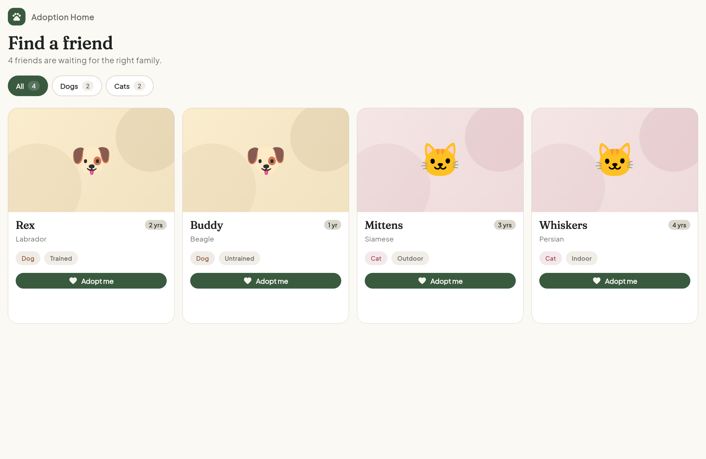

# GATES IT Solution, Full-Stack Developer Assessment



- **`01-answers/`** — my answer to the assessment, not using any AI but only googling

- **`02-showcase/`** — the same two tasks, but this is **how I use AI**. I directed Claude (with the `superpowers` plugin) to grow them into one real product — **Pawmise**, a pet-adoption platform where the discount engine becomes the adoption-fee calculator. The reason why i did this is because in my current company, AI-driven development is the norm where people prioritize planning spec, implementation and test-driven development using Claude.

---

## 🔴 Try it live for 02-Showcase project

I deployed `02-showcase` so you don't have to run anything:

| | Link |
|---|---|
| 🌐 **Web app** (Flutter, live data) | **https://marwanbukhori.github.io/gates-it/** |
| ⚙️ **API** (Laravel on Railway) | **https://pawmise-production.up.railway.app/api/v1/pets** |

The web app lists real pets served by the live API. Prefer the command line?

```bash
# Browse pets
curl https://pawmise-production.up.railway.app/api/v1/pets

# Register, then get a fee quote (loyalty/senior/shelter discounts applied)
curl -X POST https://pawmise-production.up.railway.app/api/v1/auth/register \
  -H "Content-Type: application/json" \
  -d '{"name":"You","email":"you@example.com","password":"secret1234"}'
# → copy the "token", then:
curl https://pawmise-production.up.railway.app/api/v1/pets/24/fee-quote \
  -H "Authorization: Bearer <token>"
```

---

## Run it locally

```bash
# 01 — the hand-written answers
(cd 01-answers/laravel && composer install && composer test)
(cd 01-answers/flutter && flutter pub get && flutter test)

# 02 — Pawmise (AI-built)
(cd 02-showcase/laravel && composer install && cp .env.example .env && php artisan key:generate)
(cd 02-showcase/laravel && php artisan migrate --seed && php artisan serve)   # API on :8000
(cd 02-showcase/flutter && flutter pub get && flutter run -d chrome)
```

Needs PHP ≥ 8.4 + Composer and Flutter ≥ 3.22 (`brew install php composer && brew install --cask flutter`).

---

Happy to walk through any of it.

**Marwan Bukhori** · [marwanbukhori.dev@gmail.com](mailto:marwanbukhori.dev@gmail.com)
